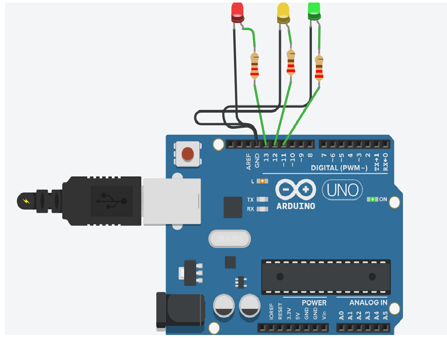

# arduino-trafficlight
Arduino traffic light simulation built using Tinkercad with LEDs and timing logic.
# Arduino Traffic Light Simulation

## Overview
This project simulates a basic traffic light system using Arduino Uno in Tinkercad.

## Components Used
- Arduino Uno
- Red LED
- Yellow LED
- Green LED
- 220Ω Resistors
- Breadboard
- Jumper Wires

## Working
The LEDs glow in the following sequence:
1. Red
2. Yellow
3. Green
4. Repeat continuously

## Files
- traffic_light.ino - Arduino source code
- ckt.png - Circuit diagram
- simulation.png - Simulation screenshot

## Circuit Diagram

## Simulation

## Skills Demonstrated
- Arduino Programming
- Circuit Simulation
- Digital Electronics
- Basic Embedded Systems
